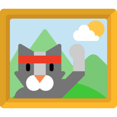

  
  <h1 align="center">4 Pics 1 Word</h3>
	
HSC SDD Task 2

4 pics 1 word is a popular puzzle game for mobile devices that contains four pictures with one thing in common. The developer of 4 pics 1 word, LOTUM has enlisted you to develop a desktop version of the game. The game must randomise the pictures and letters, include at least six levels, maximum five guesses per word with a hint after the third attempt and a printable scoreboard.

## Task specifications

Students are to design and construct a full software solution in Visual Studio (Visual C#) to ONE of the following case problems. Each product should allow for at least ten minutes of varied interaction by the user, be appropriate for the intended audience and utilise logical coding structures and project management techniques. Students should endeavour to find an efficient software solution with appropriate use of features applicable to their chosen problem.

## Table of Contents

- [Getting Started](#getting-started)
	- [Install](#install)
	- [How to play](#how-to-play)
- [General Specifactations](#Specifacations)
	- [IPO Chart](#IPO-Chart)
	- [Data Flow Diagram](#data-flow-diagram)
	- [Structure Chart](#Structure-chart)
	- [Data Dictionary](#data-dictionary)
	- [Story Board](#storyboard)
- [Changelog](#changelog)
- [Copyright](#copyright)

## Getting Started

### Install

Click here -> [Latest Release](Https://google.com)

### How to play

How to play here

## Specifacations

### IPO Chart

### Data Flow Diagram

### Structure Chart

### Data Dictionary

### Storyboard

## Changelog

[Changelog](https://github.com/OscarWright/HSCSDD-T2-4P1W/blob/main/changelog.md)

## Copyright

[MIT License](https://github.com/OscarWright/HSCSDD-T2-4P1W/blob/main/LICENSE) © 2022 [Oscar Wright](https://github.com/OscarWright).
